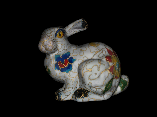
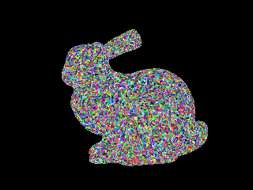

# Currender: A CPU renderer for computer vision
**Currender** is a CPU raytracing/rasterization based rendering library written in C++.
With 3D triangular mesh and camera parameters, you can easily render color, depth, normal, mask and face id images.

|color|depth|
|---|---|
|||


|normal|mask|face id|
|---|---|---|
||||

Currender is primarily designed for people who are involved in computer vision.
Pros and cons against popular OpenGL based rendering are listed below.
## Pros
- **Simple API, set mesh, set camera and render.**
  - You do not waste time in complex OpenGL settings.
- **Standard coordinate system in computer vision community**
  - Identical to OpenCV (right-handed, z:forward, y:down, x:right). You are not irritated by coordinate conversion for OpenGL.
- **Intrinsic parameters (principal point and focal length in pixel-scale) with pinhole camera model**
  - Popular camera projection representation in computer vision. You are not annoyed with converting the intrinsics to perspective projection matrix for OpenGL.
- **Rendering depth, normal, mask and face id image is enabled as default.**
  - Computer vision algorithms often process them besides color image.
- **Fast for lower resolution.**
  -  Enough speed with less than VGA (640 * 480). Such small image size is commonly used in computer vison algorithms.
- **Rendered images are directly stored in RAM.**
  - Easy to pass them to other CPU based programs.
- **Easily port to any platform.**
  - No hardware or OS specific code is included.

## Cons
- Slow for higher resolution due to the nature of CPU processing.
- Showing images on window is not supported. You should use external libraries for visualization.
- Not desgined to render beautiful and realistic color images. Only simple diffuse shading is implemented. 

# Usage
This is the main function of `minimum_example.cc` to show simple usage of API. 
```C++
int main() {
  // make an inclined cube mesh with vertex color
  auto mesh = MakeExampleCube();

  // initialize renderer enabling vertex color rendering and lambertian shading
  currender::RendererOption option;
  option.diffuse_color = currender::DiffuseColor::kVertex;
  option.diffuse_shading = currender::DiffuseShading::kLambertian;

  // select Rasterizer or Raytracer
#ifdef USE_RASTERIZER
  std::unique_ptr<currender::Renderer> renderer =
      std::make_unique<currender::Rasterizer>(option);
#else
  std::unique_ptr<currender::Renderer> renderer =
      std::make_unique<currender::Raytracer>(option);
#endif

  // set mesh
  renderer->set_mesh(mesh);

  // prepare mesh for rendering (e.g. make BVH)
  renderer->PrepareMesh();

  // make PinholeCamera (perspective camera) at origin.
  // its image size is 160 * 120 and its y (vertical) FoV is 50 deg.
  int width = 160;
  int height = 120;
  float fov_y_deg = 50.0f;
  Eigen ::Vector2f principal_point, focal_length;
  CalcIntrinsics(width, height, fov_y_deg, &principal_point, &focal_length);
  auto camera = std::make_shared<currender::PinholeCamera>(
      width, height, Eigen::Affine3d::Identity(), principal_point,
      focal_length);

  // set camera
  renderer->set_camera(camera);

  // render images
  currender::Image3b color;
  currender::Image1f depth;
  currender::Image3f normal;
  currender::Image1b mask;
  currender::Image1i face_id;
  renderer->Render(&color, &depth, &normal, &mask, &face_id);

  // save images
  SaveImages(color, depth, normal, mask, face_id);

  return 0;
}
```

`examples.cc` shows a varietiy of usage (Bunny image on the top of this document was rendered by  `examples.cc`).

# Use case
Expected use cases are the following but not limited to
- Embedded in computer vision algortihm with rendering.
  - Especially in the case that OpenGL is used for visualization, so you hesitate to use OpenGL for algorithm with rendering simultaneously.
- Debugging of computer vision algortihm.
- Data augumentation for machine learning.

# Dependencies
## Mandatory
- Eigen
    https://github.com/eigenteam/eigen-git-mirror
    - Math
- NanoRT
    https://github.com/lighttransport/nanort
    - Ray intersection acceralated by BVH
## Optional
- stb
    https://github.com/nothings/stb
    - Image I/O
- LodePNG
    https://github.com/lvandeve/lodepng
    - .png I/O particularly for 16bit writing that is not supported by stb
- tinyobjloader
    https://github.com/syoyo/tinyobjloader
    - Load .obj
- tinycolormap
    https://github.com/yuki-koyama/tinycolormap
    - Colorization of depth, face id, etc.
- OpenMP
    (if supported by your compiler)
    - Multi-thread accelaration


# Build
- `git submodule update --init --recursive`
  - To pull dependencies registered as git submodule. 
- Use CMake with `CMakeLists.txt`.
  -  `reconfigure.bat` and `rebuild.bat` are command line CMake utilities for Windows 10 and Visual Studio 2017.

# Platforms
Tested on
- Windows 10 with Visual Studio 2017.
- Ubuntu 18.04 LTS with gcc

Porting to the other platforms (Android, Mac and iOS) is under planning.
Minor modifitation of code and CMakeLists.txt would be required.

# To do
- Porting to other platforms.
- Real-time rendering visualization sample with external library (maybe OpenGL).
- Support point cloud rendering.
- Replace NanoRT with own ray intersection.
- Introduce ambient and specular.

# Data
 Borrowed .obj from [Zhou, Kun, et al. "TextureMontage." ACM Transactions on Graphics (TOG) 24.3 (2005): 1148-1155.](http://www.kunzhou.net/tex-models.htm) for testing purposes.
