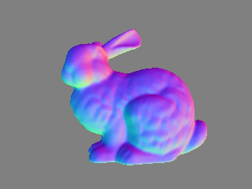

# Currender: A computer vision friendly CPU rendering library
**Currender** is a CPU raytracing based rendering library written in C++.
With 3D triangular mesh and camera parameters, you can easily render color, depth, normal and mask images ([input mesh](#Data)).

|color|depth|normal|mask|
|---|---|---|---|
||||

Currender is primarily designed for people who are involved in computer vision.
Pros and cons against popular OpenGL based rendering are listed below.
## Pros
- **Simple API, set mesh, set camera and render.**
  - You do not need to waste time in complex OpenGL settings.
- **Standard coordinate system in computer vision community**
  - Identical to OpenCV (right-handed, z:forward, y:down, x:right). You are not irritated by coordinate conversion for OpenGL.
- **Intrinsic parameters (principal point and focal length in pixel-scale) with pinhole camera model**
  - Popular camera projection representation in computer vision. You are not annoyed with converting the intrinsics to perspective projection matrix for OpenGL.
- **Rendering depth, normal and mask image is enabled as default.**
  - Computer vision algorithms often process them besides color image.
- **Fast for lower resolution.**
  -  Enough speed with less than VGA (640 * 480). Such small image size is commonly used in computer vison algorithms.
- **Rendered images are directly stored in RAM.**
  - Easy to pass them to other CPU based programs.
- **Easily port to any platform.**
  - No hardware or OS specific code is included.

## Cons
- Slow for higher resolution due to the nature of raytracing.
- Showing images on window is not supported. You should use external libraries for visualization.
- Not desgined to render beautiful and realistic color images. Only simple diffuse shading is implemented. 

# Usage
See `minimum_example.cc` for the shortest usage. `examples.cc` shows a varietiy of usage (Bunny image on the top of this document was rendered by  `examples.cc`).

# Use case
Expected use cases are the following but not limited to
- Embedded in computer vision algortihm with rendering. 
    - Especially in the case that you don't want to use OpenGL for algorithm. For instance, OpenGL based visualization is running on the main thread and on another thread an algorithm should render images from explicit 3D model to estimate something without blocking the visualization.
- Debugging of computer vision algortihm.
- Data augumentation for machine learning.

# Dependencies
## Mandatory
- GLM
    https://github.com/g-truc/glm
    - Math
- NanoRT
    https://github.com/lighttransport/nanort
    - Ray intersection with BVH
## Optional
- stb
    https://github.com/nothings/stb
    - Image I/O
- tinyobjloader
    https://github.com/syoyo/tinyobjloader
    - Load .obj
- OpenMP
    (if supported by your compiler)
    - Multi-thread accelaration

# Build
- `git submodule update --init --recursive`
  - To pull dependencies registered as git submodule. 
- Use CMake with `CMakeLists.txt`.
  -  `reconfigure.bat` and `rebuild.bat` are command line CMake utilities for Windows 10 and Visual Studio 2017.

# Platforms
Tested on Windows 10 and Visual Studio 2017.
Porting to the other platforms (Linux, Android, Mac and iOS) is under planning.
Minor modifitation of code and CMakeLists.txt would be required.

# To do
- Porting to other platforms.
- Real-time rendering visualization sample with external library (maybe OpenGL).
- Support point cloud rendering.
- Replace GLM with own math.
- Replace NanoRT with own ray intersection.
- Introduce ambient and specular.

# Data
 Borrowed .obj from [Zhou, Kun, et al. "TextureMontage." ACM Transactions on Graphics (TOG) 24.3 (2005): 1148-1155.](http://www.kunzhou.net/tex-models.htm) for testing purposes.
